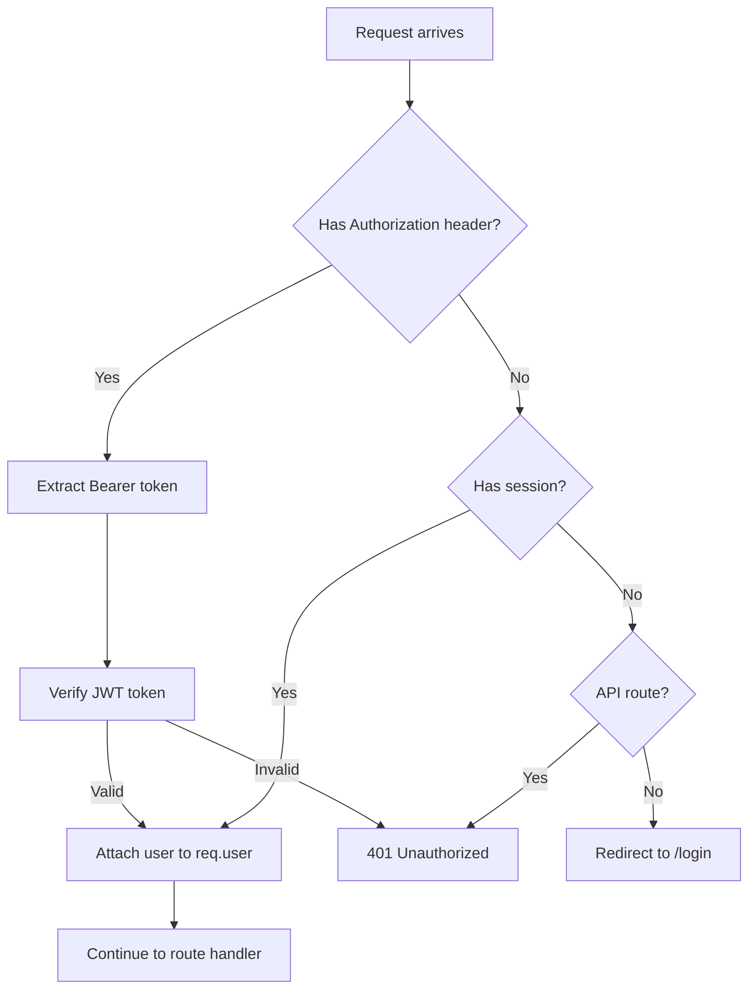

# Add Bearer Token Authentication in Parallel with Session Auth

## Overview

Add Bearer token (JWT) authentication support that works alongside the existing session-based authentication. The `requireAuth` middleware will accept either authentication method, allowing API clients to use Bearer tokens while maintaining session support for web views.

## Architecture

## Implementation Steps

### 1. Install Dependencies

Add `jsonwebtoken` package to `package.json`:

- Run `npm install jsonwebtoken`
- This will be used for generating and verifying JWT tokens

### 2. Update Environment Configuration

Add JWT secret to environment variables:

- Update `docs/env.example` to include `JWT_SECRET` variable
- Document that this should be a strong random string (different from `SESSION_SECRET`)

### 3. Create Token Utility Module

Create `middleware/tokenUtils.js`:

- `generateToken(username)` - generates JWT token with username payload
- `verifyToken(token)` - verifies and decodes JWT token
- Token expiration: 24 hours (matching session maxAge)
- Use `process.env.JWT_SECRET` for signing/verification

### 4. Update Authentication Middleware

Modify `middleware/auth.js`:

- Update `requireAuth` to check for Bearer token first in `Authorization` header
- If Bearer token present: extract, verify, and attach user to `req.user`
- If no Bearer token: fall back to existing session check (`req.session.user`)
- Maintain existing behavior: 401 for API routes, redirect for view routes
- Ensure `req.user` is set consistently (from token or session) for downstream handlers

### 5. Add API Login Endpoint

Add to `controllers/authCntrl.js`:

- `apiLoginCtrl(req, res)` - new async function for API login
- Accepts `username` and `password` in JSON body
- Validates credentials using existing `getUserByUsername` and `verifyPassword`
- On success: returns `{ token: "<jwt_token>", username: "<username>" }` with 200 status
- On failure: returns `{ error: "Invalid username or password" }` with 401 status
- Does NOT create a session (pure API endpoint)

### 6. Add API Login Route

Update `index.js`:

- Add route: `app.post('/api/login', apiLoginCtrl)`
- This route should be public (no `requireAuth` middleware)
- Import `apiLoginCtrl` from `controllers/authCntrl.js`

### 7. Update Package Dependencies

The `package.json` will automatically include `jsonwebtoken` after installation.

## Files to Modify

1. **[middleware/auth.js](middleware/auth.js)** - Update `requireAuth` to check Bearer tokens
2. **[controllers/authCntrl.js](controllers/authCntrl.js)** - Add `apiLoginCtrl` function
3. **[index.js](index.js)** - Add `/api/login` route
4. **[docs/env.example](docs/env.example)** - Add `JWT_SECRET` documentation
5. **[middleware/tokenUtils.js](middleware/tokenUtils.js)** - New file for token utilities

## Testing Considerations

- API clients can authenticate via `POST /api/login` with credentials
- API clients can use `Authorization: Bearer <token>` header for protected routes
- Web browser sessions continue to work as before
- Both authentication methods work simultaneously
- Token expiration matches session expiration (24 hours)

## Backward Compatibility

- All existing session-based authentication continues to work
- No changes required to existing login flow for web views
- Admin page (`/admin`) continues to use session-based auth
- API routes accept either authentication method

