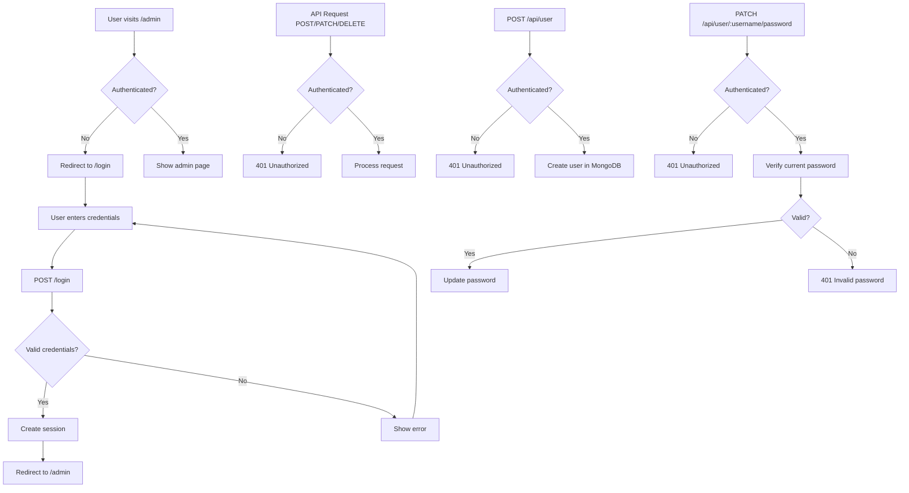

# Admin Authentication System

## Overview

Add session-based user authentication to protect the admin view and admin API endpoints. Admin users will be stored in MongoDB, and a login page will be created for authentication.

## Architecture

## Implementation Steps

### 1. Install Dependencies

Add required packages to `package.json`:

- `express-session` - for session management

- `bcrypt` - for password hashing

### 2. Create User Model

Create `model/usersMongoDb.js` following the same pattern as `hikesMongoDb.js`:

- `getUserByUsername(username)` - find user by username
- `createUser(username, password)` - create new admin user

- `verifyPassword(user, password)` - verify password using bcrypt
- Use MongoDB collection `users` in the same `matkad` database

### 3. Add Password Change API Endpoint

Add to `controllers/apiCntrl.js`:

- `apiChangePasswordCntrl(req, res)` - handle PATCH `/api/user/:username/password`
  - Accept current password and new password in request body
  - Verify current password matches
  - Hash new password using bcrypt
  - Update user password in MongoDB
  - Return 200 on success, 401 if current password incorrect, 404 if user not found
- Protect endpoint with `requireAuth` middleware
- Optionally: allow users to change their own password or require admin privileges

Add route to `index.js`:

- `PATCH /api/user/:username/password` - protected route for changing user passwords

Update `model/usersMongoDb.js`:

- `updateUserPassword(username, hashedPassword)` - update password for existing user

### 4. Create Authentication Middleware

Create `middleware/auth.js`:

- `requireAuth(req, res, next)` - middleware to check if user is authenticated

- Redirects to `/login` if not authenticated (for view routes)
- Returns 401 for API routes if not authenticated

### 5. Create Authentication Controller

Create `controllers/authCntrl.js`:

- `loginCtrl(req, res)` - render login page
- `loginPostCtrl(req, res)` - handle login form submission
- Validate credentials against MongoDB
- Create session on success
- Redirect to `/admin` or show error
- `logoutCtrl(req, res)` - handle logout, destroy session

### 6. Create Login View

Create `views/login.ejs`:

- Login form with username and password fields

- Error message display

- Follow existing EJS template patterns (include header component)

### 7. Update Server Configuration

Update `index.js`:

- Configure express-session middleware
- Add session secret from environment variable

- Add login routes: `GET /login`, `POST /login`, `POST /logout`
- Apply `requireAuth` middleware to `/admin` route
- Apply `requireAuth` middleware to admin API routes (POST, PATCH, DELETE)

### 8. Update Admin Controller

Update `controllers/adminViewCntrl.js`:

- Remove TODO comment
- Controller will be protected by middleware, so no changes needed to logic

### 9. Update API Controller

Update `controllers/apiCntrl.js`:

- Apply authentication middleware to:

- `apiAddHikeCntrl` (POST)
- `apiDeleteHikeCntrl` (DELETE)
- `apiPatchHikeCntrl` (PATCH)

- `apiPostParticipantCntrl` (POST) - optional, decide if this should be protected

### 10. Environment Variables

Add to `.env` file (or document in README):

- `SESSION_SECRET` - secret key for session encryption

### 11. Add User Creation API Endpoint

Add to `controllers/apiCntrl.js`:

- `apiCreateUserCntrl(req, res)` - handle POST `/api/user`
  - Accept username and password in request body
  - Hash password using bcrypt
  - Create user in MongoDB via `createUser()` from user model
  - Return 201 on success, 400/409 on error (duplicate username, validation errors)
- Protect endpoint with `requireAuth` middleware (only authenticated admins can create users)

Add route to `index.js`:

- `POST /api/user` - protected route for creating new admin users

## Files to Create

- `model/usersMongoDb.js` - user model with MongoDB operations
- `middleware/auth.js` - authentication middleware
- `controllers/authCntrl.js` - authentication controller
- `views/login.ejs` - login page template

## Files to Modify

- `index.js` - add session middleware, auth routes, and user management API routes
- `controllers/adminViewCntrl.js` - remove TODO comment
- `controllers/apiCntrl.js` - add auth middleware to protected endpoints, add user creation and password change endpoints
- `model/usersMongoDb.js` - add `updateUserPassword()` function
- `package.json` - add express-session and bcrypt dependencies

## Security Considerations

- Passwords will be hashed using bcrypt before storing in MongoDB
- Session cookies will be httpOnly and secure (in production)
- Session secret should be stored in environment variables

