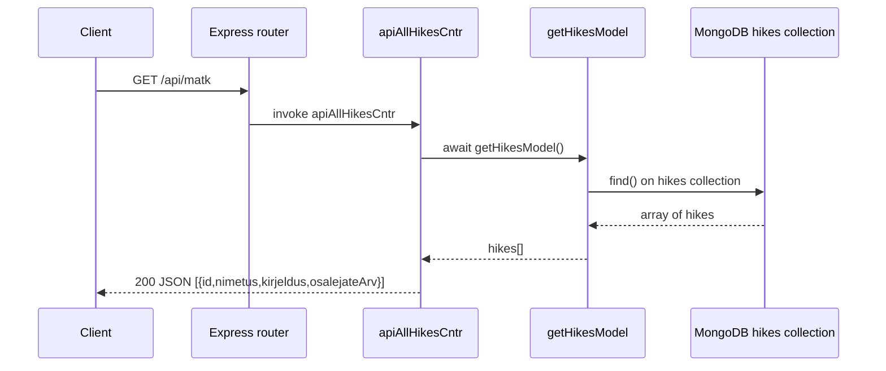

# Project info
- Express/JS app; endpoints in `index.js`; controllers in `controllers/`; data ops in `model/` (file or Mongo).

# Hike list flow (GET /api/matk)
- Route: `GET /api/matk` -> `apiAllHikesCntr`.
- Controller: calls `getHikesModel()` to load hikes, returns trimmed JSON array `{id, nimetus, kirjeldus, osalejateArv}`.
- Data source: `model/hikesMongoDb.js` loads from MongoDB `hikes` collection.

